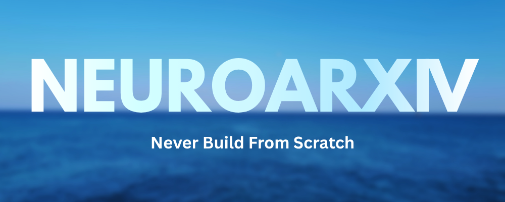

# NeuroArxiv



**A skill to kill from-scratch coding.**

Before Claude designs something new, it checks arXiv first — real papers,
read in isolation, converged into one cited recommendation. Not a search
wrapper. A second opinion your architecture decisions didn't used to get.

## The problem

arXiv is the largest source of truth on Earth for "has anyone solved this
already." Almost nobody about to write code actually checks it. Vibecoders
and time-pressed devs pick a plausible-sounding architecture, build it, hit
the exact failure mode a 2024 paper already documented, and rebuild —
burning hours and tokens on a direction the literature would have ruled out
in the first five minutes.

The fix isn't "tell the agent to be smarter." It's giving the agent a real
literature-search reflex, wired into the same divergent → convergent shape
[ADHD](https://github.com/UditAkhourii/adhd) uses for ideation, except here
the "divergence" isn't imagined — it's real papers, fetched over real HTTP,
read in isolation so no branch anchors another.

## How it works

```
PROBLEM
  │
  ▼
0. CATEGORIZE  — map the problem onto 3-5 arXiv categories + search terms
  │
  ▼
1. FETCH       — real HTTP against export.arxiv.org, category by category
  │               (no LLM call — deterministic, courtesy-rate-limited)
  ▼
2. DIVERGE     — one isolated LLM read per paper, in parallel
  │               (each sees ONE abstract, never the others)
  ▼
3. SCORE       — relevance / practicality / rigor, per paper
   + CLUSTER   — group by underlying architectural angle
  │
  ▼
4. CONVERGE    — pick ONE cluster as the recommended path, synthesize,
                 cite, name the first step, name the risk, list pitfalls
                 pulled from EVERY paper's limitation — not just the winner's
```

The convergence step is the deliberate departure from open-ended
brainstorming tools: NeuroArxiv does not hand back a shortlist of "here are
4 papers, you decide." A vibecoder with 4 options and no time is still
stuck. It commits to one recommendation, states why the runner-ups lost,
and tells you what to watch for even in the paths not taken.

## The eval

We ran the same 5 build problems through the same underlying model twice —
once cold (no tools, straight from the model's own reasoning), once forced
through NeuroArxiv's isolate → score → cluster → converge loop — and diffed
the two sets of answers directly. This is small and self-graded, not a
peer-reviewed benchmark; treat the numbers below as a first data point, not
a proof.

**Design quality**, judged scenario by scenario:

| Scenario | Verdict |
| --- | --- |
| Rate limiter across a leader election | Tied — both landed on the same architecture; NeuroArxiv added a risk note, not a better design |
| RAG pipeline: filter irrelevant retrieved context | Marginal win — more precise mechanism (NLI/entailment filter vs. a generic reranker), sharper failure mode |
| Multiple coding agents coordinating on one repo | **Clear win** — named an actual protocol (Contract-Net claim rounds) where the cold answer left "who releases the lock, on what timeout" unanswered |
| Add a boolean dark-mode settings flag | N/A — correctly **aborted** the pre-flight gate, zero fetches spent on a trivial task |
| Postgres p99 latency, small skewed hot set | **Clear win** — specified *how* to track a shifting hot set (heavy-hitter/count-min sketch) where the cold answer just said "add a cache" |

**2 clear wins, 1 marginal win, 1 tie, 1 correct abort, out of 5.** Not a
sweep — the tie is a real result, not cherry-picked out. The pattern behind
the wins: NeuroArxiv pulled ahead specifically when the sub-problem the cold
answer glossed over was exactly what the cited paper's mechanism was built
to solve.

**Cost**, aggregated across all 5 scenarios:

| | Cold (no skill) | NeuroArxiv | Delta |
| --- | ---: | ---: | ---: |
| Wall-clock | 28.2s | 342.5s | ~12x |
| Tokens | 48,178 | 79,638 | ~1.65x |
| Real arXiv fetches | 0 | 9 | — |

The cost is not evenly spread — the trivial scenario cost nothing (correct
abort before any fetch), and the 12x/1.65x is concentrated in the four
scenarios that actually warranted a literature check. This run also used a
budget-constrained isolation mode (sequential single-context reads instead
of true parallel Agent-per-paper spawns) to keep 5 scenarios tractable in
one sitting, so both the token count and wall-clock here are approximations
of the loop as specified in [SKILL.md](skills/neuroarxiv/SKILL.md), not an
exact measurement of it.

## Usability, actionability, impact

- **Usable mid-build.** It's a skill, not a research assistant you context-
  switch to — `/neuroarxiv <problem>` from inside Claude Code, or invoked
  automatically via the pre-flight gate in
  [SKILL.md](skills/neuroarxiv/SKILL.md) whenever a coding agent is about
  to commit to a non-trivial architecture.
- **Actionable output.** Every recommendation ships with a first concrete
  step, a named load-bearing risk, and an explicit avoid-list — not a
  literature summary to go read yourself.
- **Grounded, not hallucinated.** Every claim traces to a fetched abstract.
  Papers, ids, and links are real arXiv metadata, never invented — the read
  prompt is explicitly forbidden from quoting more than a few words
  verbatim, and the skill's anti-patterns section calls out hallucinated
  citations as the failure mode to watch for.

## Install

One line, no clone, no build step to run yourself — drops the skill straight
into `~/.claude/skills/neuroarxiv`:

```bash
npx github:UditAkhourii/neuroarxiv install
```

Restart Claude Code (or start a new session) and `/neuroarxiv "<problem>"`
is live.

Prefer the full local checkout (for editing the engine, running the CLI
directly, or contributing)?

```bash
git clone https://github.com/UditAkhourii/neuroarxiv.git
cd neuroarxiv
npm install
npm run build
node dist/cli.js install
```

## Usage

```bash
neuroarxiv "cache LLM completions across requests without serving stale answers"
neuroarxiv "leader election for a queue with flaky nodes" --papers 6
neuroarxiv "..." --categories cs.DB,cs.DC --json > out.json
```

See `neuroarxiv --help` for the full flag list (paper count, concurrency,
recency filter, model overrides).

Inside Claude Code, no install is needed — the skill in
[skills/neuroarxiv/SKILL.md](skills/neuroarxiv/SKILL.md) runs the same loop
using `WebFetch` against arXiv's export API directly.

## A real worked example

Running the categorize + fetch phases live against
`"cache LLM completions across requests without serving stale answers"`
(pinning categories to skip the category-select call) returned this —
captured verbatim, nothing edited:

```
▸ categories: cs.DB, cs.DC | terms: cache, completions, across, requests, without
  2 papers (cs.DB)
  1 papers (cs.DC)
◎ reading [2606.20539] Caching for Dollars, Not Hits: An Exact Offline Reference
  for Cloud-Egress Caching and the Crossover That Decides When It Pays
◎ reading [2508.12485] Cold-RL: Learning Cache Eviction with Offline
  Reinforcement Learning for NGINX
◎ reading [2607.19214] Keeping the Cache Warm Pays: Keepalive Economics
  for Agentic Workloads
```

Three real, current (2025-2026) papers, none synthetic. The read/score/
converge phases need a `claude` subprocess with a live OAuth session, which
this particular capture environment (a nested Claude Code session) doesn't
have — the exact same constraint the sibling `adhd-agent` CLI depends on
too. So the phase below is **hand-walked using the same rules the SKILL.md
convergence step follows**, not a captured tool run — labeled honestly as
such:

> **THE PATH — prefix-keepalive plays**
>
> Treat "don't serve a stale completion" as two separable problems: keeping
> a cache entry alive cheaply, and deciding when that entry stops being
> valid. For the first, borrow the keepalive paper directly — replay the
> prompt's cached prefix on a timer just under the provider's cache TTL
> (~4 min for Anthropic's 5-min TTL) during any pause where your agent is
> waiting on a tool call or approval, instead of letting the prefix evict
> and paying a full prefill later. It's a client-side timer, no training
> infra, no new dependency — the cheapest lever in this pool. Layer your
> own cache on top with an explicit invalidation key, not a TTL alone: hash
> the parts of the prompt that can go stale (retrieved docs, tool output,
> live data) separately from the parts that can't, so the keepalive holds
> the *stable* prefix warm indefinitely while the *volatile* suffix always
> misses and regenerates.
>
> **First step:** add a client-side keepalive that replays the cached
> prefix during any wait state, at an interval just under the provider's
> cache TTL — before touching eviction policy at all.
>
> **Load-bearing risk:** a keepalive keeps the cache *alive* — it says
> nothing about whether the content is still *correct*. Pairing it with
> zero invalidation logic just means a stale answer survives longer.
>
> **Avoid:** don't reach for a learned/RL eviction policy (Cold-RL) before
> checking whether a cost-aware heuristic or a bigger cache already closes
> the gap — its own numbers show the RL advantage collapses once the cache
> is large relative to the working set. And don't optimize purely for
> hit-rate or dollar cost (either Cold-RL or the cloud-egress paper) without
> a separate staleness signal — neither paper models correctness at all.
>
> **Alternates considered:** *cost-aware-eviction plays* (the cloud-egress
> paper) — a genuinely useful closed-form crossover formula for when
> dollar-aware eviction pays off, but it's a refinement layer, not a fix for
> the stated staleness problem. *learned-eviction plays* (Cold-RL) — real,
> reproducible gains, but needs offline RL training infra for what is, for
> this specific problem, a secondary lever.
>
> **Open thread:** none of the three papers touch the actual correctness
> question — how do you know a cached completion is now wrong? That's an
> invalidation-signal problem, worth a second, narrower pass (try `cs.DB` +
> `cs.IR` with terms like "cache invalidation" and "staleness detection")
> before shipping.

That's the shape of the output on every run: real citations, one committed
recommendation, an honest account of what lost, and a pointer to the gap
the search didn't close.

## Repo layout

```
skills/neuroarxiv/SKILL.md   the Claude-native skill (WebFetch-driven)
src/arxiv.ts                 real HTTP client for export.arxiv.org
src/categories.ts             curated arXiv taxonomy for category-select
src/engine.ts                 categorize → fetch → read → score/cluster → converge
src/llm.ts                    Claude Agent SDK wrapper
src/render.ts                 terminal renderer
src/cli.ts                    neuroarxiv CLI
tests/                        unit tests (query building, XML parsing, JSON parsing)
```

## License

MIT
